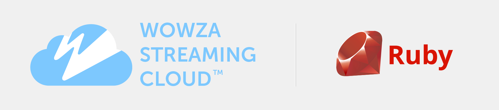

# Wowza Streaming Cloud Ruby SDK

Welcome to the official Wowza Streaming Cloud Ruby SDK (WscSdk). We help developers bring live streaming into their applications - for any size audience, anywhere in the world. This SDK leverages the Wowza Streaming Cloud REST API to programmatically control live streams, transcoders, outputs, and stream targets.

Need the basics? Get to know [Wowza Streaming Cloud](https://www.wowza.com/products/streaming-cloud).

### SDK version

v1.3.0 (references Wowza Streaming Cloud REST API version 1.3)

## Contents

- [Features](#features)
- [Installation](#installation)
- [Start building](#start-building)
    - [Get your API key and generate an access key](#get-your-api-key-and-generate-an-access-key)
    - [Create a client](#create-a-client)
    - [Access endpoints](#access-endpoints)
    - [Use templates](#use-templates)
    - [Manage Lists](#managing-lists)
    - [Error Handling](#error-handling)
- [Access the entire Wowza Streaming Cloud REST API](#access-the-entire-wowza-streaming-cloud-rest-api)
- [SDK examples](#sdk-examples)
- [Documentation](#documentation)
- [Contribute](#contribute)
- [Feedback](#feedback)
- [Support](#support)
- [Code of conduct](#code-of-conduct)
- [License](#license)


## Features

This SDK represents a subset of the features available in the Wowza Streaming Cloud REST API.

* Live streams
* Transcoders
* Outputs
* Stream targets

To add functionality related to players, stream sources, recordings, schedules, and usage metrics, see [Access the entire Wowza Streaming Cloud REST API](#access-the-entire-wowza-streaming-cloud-rest-api).


## Installation

### Prerequisites

* Ruby version 2.3 or higher
* Access to the Wowza Streaming Cloud service. You can start with our [free trial](https://www.wowza.com/pricing/cloud-developer-free-trial).


### Install the SDK

To use [RubyGems](https://rubygems.org/) for installation, add this line to your application's Gemfile:

```ruby
gem 'wsc_sdk', '~> 1.3.1'
```

And then execute:

```bash
$ bundle
```


Or install it yourself using:

```bash
$ gem install wsc_sdk
```

## Start building

### Get your API key and generate an access key

Start by getting an API key and access key to authenticate requests. You'll find them in the Wowza Streaming Cloud user interface.

1. Sign in to [Wowza Streaming Cloud](https://cloud.wowza.com).

2. In the menu bar, click your user name and choose **API Access**.

See [Locate an API key and generate an access key](https://www.wowza.com/docs/how-to-use-the-wowza-streaming-cloud-rest-api#keys) for more information.

### Create a client

To perform any SDK functions or API requests, start by creating an instance of of the `WscSdk::Client` object.  This object requires your API key and access key.  It handles all of the requirements for formulating a valid API request, and it gives you access to functions for listing, finding, creating, updating, and deleting models in the Wowza Streaming Cloud REST API.

```ruby
  require 'wsc_sdk'

  WscSdk.configure do |config|
    config.api_key      = "[your API key]"
    config.access_key   = "[your access key]"
    config.logger       = ::Logger.new(STDOUT)
  end

  client      = WscSdk.client
```
#### Set up environment variables

For higher levels of security, and to keep sensitive keys out of your repositories, you can use environment variables to configure your clients.

In a terminal you can establish the environment variables like this:

```bash
  export WSC_API_KEY=[your-api-key]
  export WSC_API_ACCESS_KEY=[your-api-access-key]
```

Then your configuration block can be setup like this:

```ruby
  require 'wsc_sdk'

  WscSdk.configure do |config|
    config.api_key      = ENV["WSC_API_KEY"]
    config.access_key   = ENV["WSC_API_ACCESS_KEY"]
    config.logger       = ::Logger.new(STDOUT)
  end

  client      = WscSdk.client
```

#### Using the sandbox for testing

Wowza Streaming Cloud has a sandbox environment you can use for testing your code without incurring charges on your account.

You can switch the hostname of the SDK to point the sandbox server for testing using this configuration:

```ruby
  require 'wsc_sdk'

  WscSdk.configure do |config|
    config.api_key      = "[your sandbox API key]"
    config.access_key   = "[your sandbox access key]"
    config.logger       = ::Logger.new(STDOUT)
    conifg.hostname     = WscSdk::SANDBOX_HOSTNAME
  end

  client      = WscSdk.client
```

### Access endpoints

You can access the controls for managing a model through endpoints.  An endpoint is typically named for the model you're managing, but in plural form.

For example, you manage the `WscSdk::Models::Transcoder` model through the `WscSdk::Endpoints::Transcoders` endpoint.

You can access endpoints through the [client](#create-a-client) object.

Using the `transcoders` example, you can access functionality to manage models like this:

```ruby
  # Assign the transcoders endpoint to a variable
  transcoders = client.transcoders

  # List all transcoders
  #
  # Returns a ModelList object which behaves like a Hash.  The keys of the Hash
  # are the primary keys of the model, and the values are the model themselves.
  #
  list = transcoders.list

  list.each do |id, transcoder|
    # Do something with the items in the list.
  end

  # Find a transcoder
  #
  # Returns the model that matches the primary key provided.  If the primary
  # key doesn't exist, a WscSdk::Models::Error object is returned.
  #
  transcoders.find('some_id')

  # Create a transcoder
  #
  # Returns the model of the newly created object. If the validation failed,
  # or there was an issue sending the data to the API, then a
  # WscSdk::Models::Error object is returned.
  #
  transcoders.create(some_transcoder_model)

  # Update a transcoder
  #
  # Returns the model of the updated object. If the validation failed,
  # or there was an issue sending the data to the API, then a
  # WscSdk::Models::Error object is returned.
  #
  transcoders.update(some_transcoder_model)

  # Delete a transcoder
  #
  # Returns the model data of the deleted object, with the primary key value
  # removed. If there was an issue sending the data to the API, then a
  # WscSdk::Models::Error object is returned.
  #
  transcoders.delete(some_transcoder_model)
```

The `Endpoint#list`, `Endpoint#find(id)`, `Endpoint#create(model_object)`, `Endpoint#update(model_object)`, and `Endpoint#delete(model_object)` methods are the most common methods inside of an endpoint, however these will change from model-to-model, so check the code [documentation](#documentation) for specific details on the model you're attempting to interact with.

### Use templates
This SDK provides predefined templates to make it easier to configure a model with common data values. Templates are available for live streams, transcoders, outputs, custom stream targets, Wowza stream targets, and ultra low latency stream targets.

You use a template when using an endpoint to create a model. For example, to create a transcoder that uses the RTMP protocol to push a stream from the source to Wowza Streaming Cloud, use a template like this:

```ruby
# Build an RTMP/push transcoder using a predefined template
name            = "My First SDK Transcoder"
transcoder_data = WscSdk::Templates::Transcoder.rtmp_push(name)
```

Values for *transcoder_type*, *billing_mode*, *broadcast_location*, *protocol*, *delivery_method* and more are set by default.


To override a preset value, add a modifier key:value pair like this:

```ruby
# Build an RTMP/push transcoder using a predefined template with a modifier
name            = "My First SDK Transcoder"
transcoder_data = WscSdk::Templates::Transcoder.rtmp_push(name, broadcast_location: "eu_germany")
```

You can see the details for each available template in the [Templates documentation](https://wowza.com/resources/wsc/sdk/ruby/WscSdk/Templates.html). Click **View source** to see the preset values.

### Manage lists

All of the endpoints that return lists allow you to control how the data is returned. You can configure the lists with following options:

- **Pagination**
- **Filtering**

#### Paginate lists

Most Wowza Streaming Cloud REST API endpoints allow you to paginate the results of lists. The SDK fully supports this functionality by passing optional parameters to `client.[endpoint].list` requests.

###### Pagination parameters:

- **page**: The page number of to request
- **per_page**: The number of items per page to request.

Using your [client](#create-a-client) object, you can request a paginated list like this:

```ruby
  client.transcoders.list(pagination: { page: 1, per_page: 20 })
```

The resulting list `Hash` will have a special key for the pagination information called `:pagination`.  If you access this key, you'll get back information about the current pagination information.

#### Filter lists

**Note:** Currently only the transcoders endpoint allows for filtering items returned in the response.

To filter content returned in a list call, you can add the `filter:` key to the `list` call.

The filter is a Hash of acceptable field names and filter values. Although the API allows for more complex filtering, currently the SDK filter accepts only direct equality filtering.

Using your [client](#create-a-client) object, you can request a list of transcoders that are currently started, like this:

```ruby
  client.transcoders.list(filter: { state: 'started' })
```

### Error handling

An SDK call that returns an unraised error will return it as a `WscSdk::Models::Error` instance.

To determine if a model or model list generated an error during it's request, you can call the `success?` method to determine the outcome.

```ruby
  transcoder_list = client.transcoders.list

  if transcoder_list.success?
    # Do some stuff with your list.
  else
    # If it wasn't a success, then the returned model is an instance of WscSdk::Models::Error.
    puts "Your request for the transcoder list generated an error: #{transcoder_list.code}: #{transcoder_list.title}"
  end
```

## Sending files through the SDK

Some API endpoints allow you to send files for use in configuring a
live stream, transcoder, player or hosted page. These files must be converted from their original format to a Base64-encoded string representation in order to be processed by Wowza Streaming Cloud.

There is a static convenience method in the client that will load a file from
your local system and properly encode it for delivery to the API.

```ruby
WscSdk::Client.file_to_base64("/path/to/some/file")
```

For example, if you want to embed a watermark image into a transcoded stream, your code might look like this:

```ruby

transcoder = $client.transcoders.build

transcoder.watermark_image = WscSdk::Client.file_to_base64("/path/to/some/file.jpg")

transcoder.save
```

## Access the entire Wowza Streaming Cloud REST API

This SDK is still under active development, so many endpoints haven't been built
in just yet. To help with this, we've exposed a low-level method inside the
client for handling any endpoint inside the API.

This method generates the necessary request headers, does some basic
interpretation of the request, and returns a Hash object of the response data.
It doesn't do any data validation or management. It's up to you to handle
the data going in and coming out of the request and make sure it's structured
according to the documentation.

See the [Wowza Streaming Cloud API reference](https://sandbox.cloud.wowza.com/api/current/docs) and [API documentation](https://www.wowza.com/docs/wowza-streaming-cloud-rest-api) for more information.

##### Examples

```ruby

  # Request a list of players
  players_list = client.request_endpoint(:get, "/players")

  # Display the list of players and their types
  players_list["players"].each do |player|
    puts "#{player["id"]}: #{player["type"]}"
  end

  # Get the details for the first player in the list
  player_id = player_list["players"].first["id"]
  player = client.request_endpoint(:get, "/players/#{player_id}")

  # Display the player details
  puts "Player:"
  player["player"].each do |attribute, value|
    puts " - #{attribute.to_s.ljust(25)} : #{value}"
  end

  # Update an existing player.
  updated_player_data = {
    player: {
      hosted_page_title: "This is my updated Hosted Page with Player",
      hosted_page_description: "new description for my hosted page"
    }
  }

  updated_player = client.request_endpoint(:post, "/players/#{player_id}", updated_player_data)
  puts "Player:"
  player["player"].each do |attribute, value|
    puts " - #{attribute.to_s.ljust(25)} : #{value}"
  end

```

## SDK examples

Check out the ruby example files in this repo to learn how to use SDK functions to configure and manage models.

- [Set up a client](/examples/client.rb)
- [Work with live streams](/examples/live_streams)
- [Work with transcoders](/examples/transcoders)
- [Work with outputs](/examples/outputs)
- [Work with stream targets](/examples/stream_targets)


## Documentation

You can dig into the details in the [Wowza Streaming Cloud Ruby SDK reference documentation](https://wowza.com/resources/wsc/sdk/ruby/index.html).


## Contribute

For the moment, we're not accepting public contributions for the Wowza Streaming Cloud Ruby SDK. We may open the code up to contributions in the future. For now, relay your concerns and things you'd like to see added by emailing us at [cloud-feedback@wowza.com](mailto:cloud-feedback@wowza.com).


## Feedback

We welcome your feedback on the SDK, its documentation, and the experience of using it. For now, we have disabled GitHub issues for this repo. To provide feedback, email us at [cloud-feedback@wowza.com](mailto:cloud-feedback@wowza.com).


## Support

For now, we have disabled GitHub issues for this repo. To request assistance with the SDK, open a support ticket with [Wowza Support](https://www.wowza.com/portal/help).


## Code of conduct

Please adhere to the guidelines described in the [license](#license) for this SDK.


## License

This code is distributed under the [BSD-3 License](LICENSE.txt).
